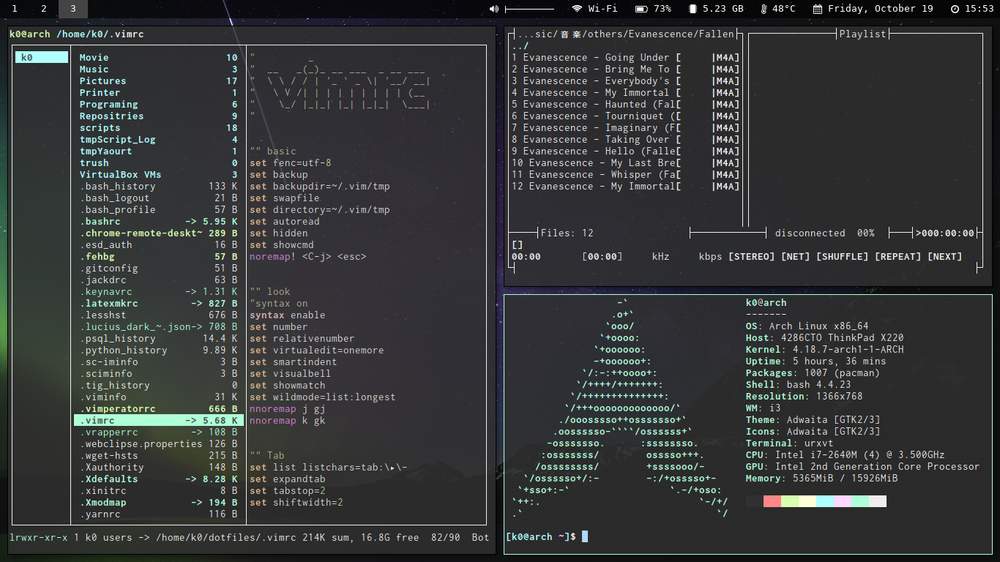

# dotfiles

These are my dotfiles for some tools and scripts I use within Arch Linux on Thinkpad X220.

## Programs

- i3-gaps
- polybar
- bash
- urxvt
- vim
- latexmk
- ranger
- feh
- Music on console
- qutebrowser
- keynav
- eclipse (vrapper)
